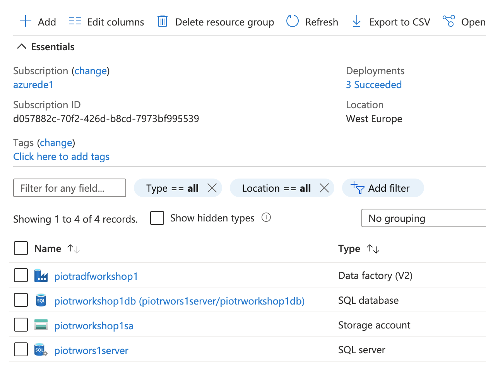

  
  
  

# Azure Data Engineer

## LAB 1
---
### Lab overview:
In this lab you are going to work with two most common data storing services:
- Azure Data Lake, which is best solution for storing unstructured data
- Azure SQL, which is an old, good, battle-tested relational database in Azure. For storing structured data of course.

The plan for the lab is like following:

1. Create all resources in Azure
2. Load data into Azure Data Lake
3. Load data into Azure SQL using Azure Data Factory
4. Create users in Azure SQL and authenticate it
5. Configuring security
6. Configuring high-availability

---
## Prerequisites:

- An active Azure subscription and a resource group created.

---

## Part 1 - Creating Azure resources
---
## Task 1: Create Azure Data Lake
1. Open Azure Portal.
1. On the home page click "Create a resource" button. (The one with large blue "plus" sign)
1. From the "storage" category select "Storage Account".
1. Fill in "basics" tabs:
   - **Subscription:** your subscription
   - **Resource Group:** your resource group
   - **Storage account name:** choose your name. Note that it need to be globally unique.
   -  **Region:** West Europe
   -  **Performance:** Standard
   -  **Redundancy:** LRS
2. Click "next" button
3. On "Advanced" tab check "Enable hierarchical namespace" checkbox. This will create the data lake instead of regular Blob Storage.
4. Leave all other setting by default but **check if you understand every option from the "Advanced", "Networking" and "Data protection" tab.**
5. Click "Review + create" tab and after the successfull validation click "Create".

## Task 2: Create Azure SQL database
1. Open Azure Portal.
1. On the home page click "Create a resource" button. (The one with large blue "plus" sign)
1. From the "Databases" category select "SQL Database".
1. Fill in "basics" tab:
   - **Subscription:** your subscription
   - **Resource Group:** your resource group
   - **Database name:** choose your name
   - **Server:** Click "Create new"
     - **Server name:** choose your name. Note that it needs to be globally unique.
     - **Server admin login:** name of the database admin user
     - **Password:** password of the database admin user (don't forget it :) )
     - **Location:** West Europe
     - Click "OK" button
   - **Want to use SQL elastic pool?:** No
   - **Compute + storage**: Click "Configure database"
   - Take a look on different types of purchasing a database. Feel free to ask any questions.
   - Select these options:
     - **Compute tier:** provisioned
     - **Compute Hardware:** Gen5
     - **vCores:** 2 vCores 
     - **Data max size:** 1GB
   - Click "Apply" button
   - Click "Next: Networking"
1. On "Networking" tab:
     - **Connectivity method:** Public Endpoint
     - **Allow Azure services and resources to access this server**: No (we will change this later)
     - **Add current client IP address**: No (we will change this later)
1. On "Security" tab:
     - **Enable Azure Defender for SQL**: Not now
1. Leave other setting by default.
1. Go to "review + create" tab, wait for the validation to be succedeed and click "Create".

## Task 3: Create Azure data factory
1. Open Azure Portal.
1. On the home page click "Create a resource" button. (The one with large blue "plus" sign)
1. From the "Integration" category select "Data factory".
1. Fill in "basics" tab:
   - **Subscription:** your subscription
   - **Resource Group:** your resource group
   - **Region**: West Europe
   - **Name**: choose your name
   - **Version**: V2
1. Go to "Git configuration" tab and check "Configure Git later".
1. Leave all other setting by default. Be sure that you understand those options. If not feel free to ask questions.
1. Create the resource. 
1. After the whole process you should have these services created in your resource group:

## END LAB - part 1

  

&copy; 2021 Chmurowisko Sp. z o.o.

