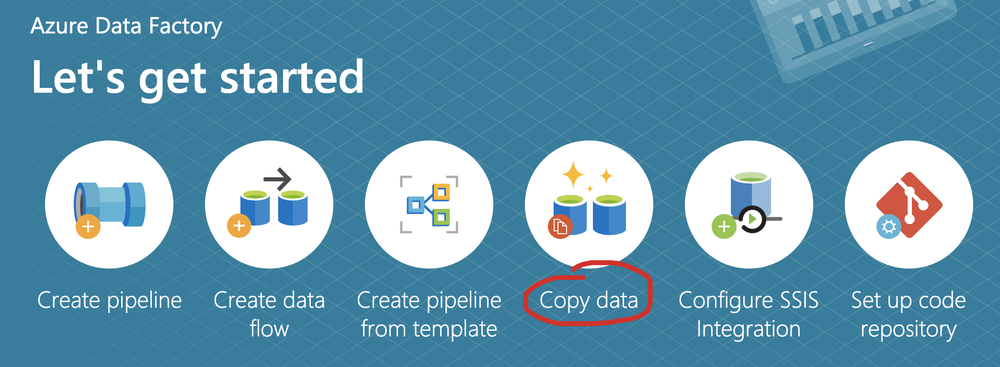

<br><br>
<br><br>
<br><br>

# Azure Data Engineer

## LAB 1
---
### Lab overview:
In this lab you are going to work with two most common data storing services:
- Azure Data Lake, which is best solution for storing unstructured data
- Azure SQL, which is an old, good, battle-tested relational database in Azure. For storing structured data of course.

The plan for the lab is like following:

1. Create all resources in Azure
2. Load data into Azure Data Lake
3. Load data into Azure SQL using Azure Data Factory
4. Create users in Azure SQL and authenticate it
5. Configuring security
6. Configuring high-availability

---
## Prerequisites:

- An active Azure subscription and a resource group created.
- Part 1 of the lab finished

---

## Part 2 - Loading data into Azure data lake and into Azure SQL using Azure Data Factory
---
## Task 1: Create new container in Azure Data Lake
1. Go to your resource group and select storage account resource.
2. From left menu select "Containers"
3. Click "Add Container"
4. Type name "data" and click "Create"

## Task 2: Install Azure Storage Explorer
1. Got to web page: https://azure.microsoft.com/en-us/features/storage-explorer/
2. Select your operating system and download installer.
3. Install the application.

## Task 3: Connect Azure Storage Explorer to the Azure Data Lake
1. Open Azure Storage Explorer
2. From left menu right-click on "Storage Accounts" and "Connect to Azure Storage"
3. "Click Storage Account or Service"
4. Check "Account name and key", click "Next"
5. Go back to Azure portal and open the Storage Account that you created.
6. From left menu select "Access keys"
7. Copy storage account name and one of the key
8. Paste those values into Azure Storage Explorer. Hit "next" and connect to your data lake.
9. Upload "user_data.csv" file into "data" container on your data lake.

## Task 4: Connect to your Azure SQL database
1. Open Azure Portal
2. Go to your resource group
3. Select your SQL server service (not the database)
4. From left menu select "Firewalls and virtual networks"
5. Turn "Allow Azure services and resources to access this server" to "yes"
6. Click "Add clinent IP" button
7. Click "Save"
8. From left menu select "SQL databases"
9. Click on your database
10. From left menu select "Query Editor"
11. Login using credentials that you provided during Azure SQL creation

## Task 5: Load data from data lake into Azure SQL using Azure Data Factory
1. Create destination table in your SQL database. Execute this query:
```
create table users
(
	[First Name] varchar(50),
	[Last Name] varchar(50),
	[Gender] varchar(50),
	[Email] varchar(50) ,
	[Phone] varchar(50) ,
	[Salary] varchar(50),
	[Marital Status] varchar(50),
	[Credit card number] varchar(50)
)
```
2. Go to your resource group and select Azure Data Factory Service
3. Click "Author & Monitor" button. This will open Azure Data Factory panel in a new tab.
4. From "Let's get started" main screen select "Copy data"

5. From "Properties" step choose a name for your Task. Click "next"
6. From "Source" step:
    - Click "Create new connection" button
    - Find "Azure data lake Storage Gen 2" and click "Continue"
    - From new menu, point on your data lake that you created
    - Click "test connection" button. If the connection is successful, click "Create"
    - Click "next"
    - In "File or folder" point to the .csv file that you uploaded recently
    - Click "next"
    - Verify that your file is properly read
    - Click "next"
7. From "Destination" step:
    - Click "Create new connection" button
    - Find "Azure SQL database" and click "Continue"
    - From new menu, point on Azure SQL that you created
    - Provide login credentials
    - Click "test connection" button. If the connection is successful, click "Create"
    - Click "next"
    - Click "Use existing table" and point to the "dbo.users" table
    - Click "next"
    - Check if column mapping is ok
    - Click "next"
8. On "Setting" page click "next"
9.  "Next" again and wait for the pipeline to finish it's run
10. In the "Query editor" verify that records have been put into the table:
```
select count(*) from users;
```

## END LAB - part 1

<br><br>

<center><p>&copy; 2021 Chmurowisko Sp. z o.o.<p></center>
